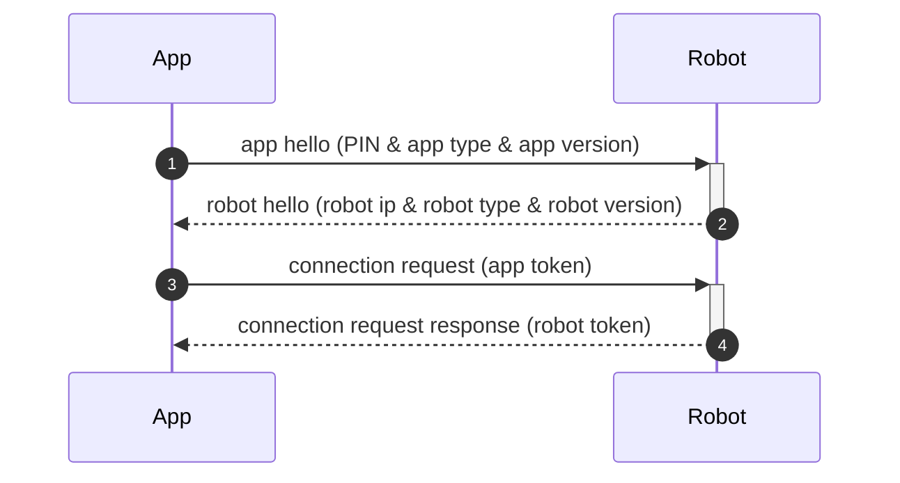
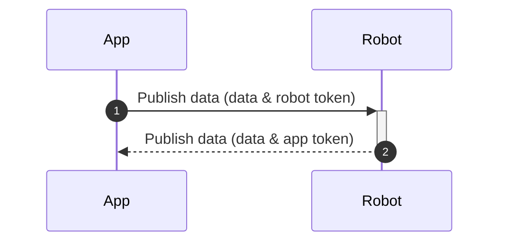
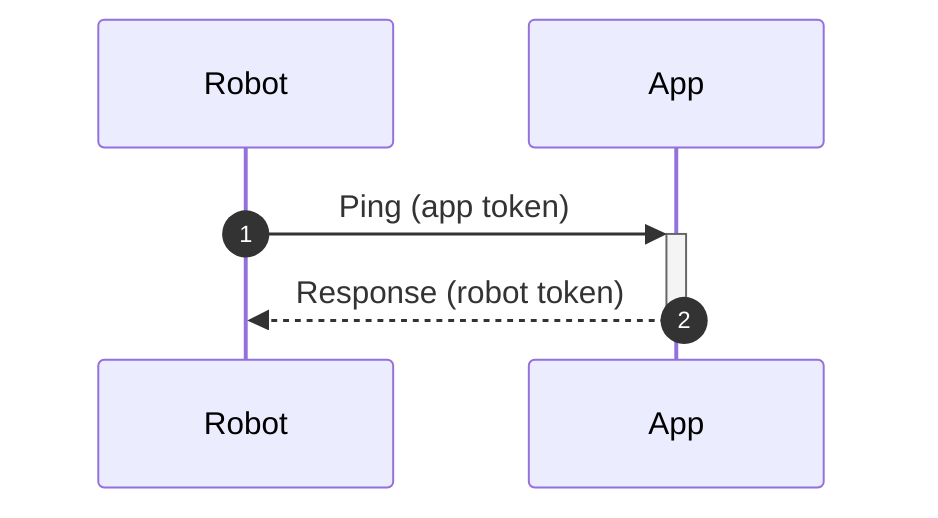

# Rencontrer sequence diagram
## Port
- App listner : 64102
- Robot listner : 64101
## Connection initialize (CI)

```mermaid
sequenceDiagram
  autonumber
  App->>+Robot: app hello (PIN & app type & app version)
  Robot-->>-App: robot hello (robot ip & robot type & robot version)
  App->>+Robot: connection request (app token)
  Robot-->>-App: connection request response (robot token)
```

## Data transform (DT)

```mermaid
sequenceDiagram
  autonumber
  App->>+Robot: Publish data (data & robot token)
  Robot-->>-App: Publish data (data & app token)
```

## Connection check (CC)

```mermaid
sequenceDiagram
  autonumber
  Robot->>+App: Ping (app token)
  App-->>-Robot: Response (robot token)
```